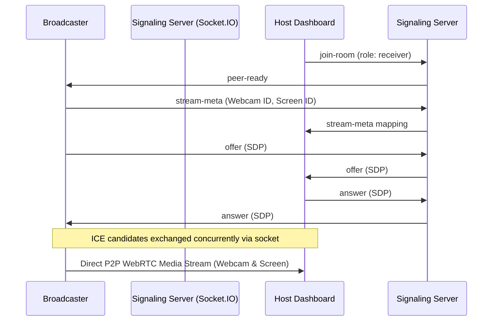

# Methodology and Technical Decisions

This document details the architectural decisions, design choices, challenges, and solutions implemented in the Dual-Stream Live Video application.

---

## 1. Real-Time Streaming Architecture

### Why WebRTC?
For video transmission, we selected **WebRTC (Web Real-Time Communication)** because it represents the state-of-the-art for sub-second, low-latency browser streaming.
- **Ultra-Low Latency**: Traditional protocols like HLS (HTTP Live Streaming) or RTMP (Real-Time Messaging Protocol) packaged through media servers suffer from latency between 2 to 30 seconds due to segment buffering. WebRTC operates peer-to-peer (P2P) over UDP (via SRTP/SCTP), establishing direct streams with latency well under 100ms on local networks.
- **P2P direct connections**: Media data travels directly between the broadcaster and host without passing through or consuming server bandwidth.
- **Standardized browser APIs**: Standardized implementation of `RTCPeerConnection` requires zero plugin installations.

### Why Socket.IO?
WebRTC is peer-to-peer but cannot bootstrap connection coordinates on its own. It requires a signaling mechanism to negotiate connection addresses and formats. We selected **Socket.IO** as the signaling channel:
- **Bi-directional event routing**: Facilitates clean relays of Session Description Protocol (SDP) offers, answers, and ICE (Interactive Connectivity Establishment) network candidates.
- **Auto-reconnection**: Automatically handles reconnect handshakes if the browser tab reloads or the client experiences a transient drop in WiFi connection.
- **Role tracking**: Simplifies socket mapping (broadcaster client vs monitor host) inside custom rooms.

---

## 2. Canvas-Based Timestamp Overlay Logic

The application requires a live clock (HH:MM:SS format) burned into the webcam feed before WebRTC transmission, so the receiver sees it permanently.

### Pipeline Implementation
1. **Acquisition**: Camera access is requested using `navigator.mediaDevices.getUserMedia`.
2. **Decoding**: The resulting raw stream is fed into an off-screen, autoplaying HTML5 `<video>` element to decode frames.
3. **Canvas Drawing**: Inside a high-frequency loop driven by `requestAnimationFrame`, we paint the current video frame onto an offscreen HTML5 `<canvas>` using `ctx.drawImage`.
4. **Drawing Text**: The current clock string is extracted (`new Date()`) and formatted. We draw a custom, translucent rounded rectangle capsule and overlay the time text.
5. **Jitter Prevention**: We use a fixed-width monospace font (`"Courier New"`) so digits do not shift width (which creates an annoying vibrating effect as seconds tick by).
6. **Re-capture**: We extract the canvas track using `canvas.captureStream(30)` (30 FPS constraint).
7. **Track Merger**: Since canvas capture streams do not contain audio, we merge the canvas video track with the original microphone audio track from step 1 into a single output `MediaStream`.

This processed stream is passed to WebRTC instead of the raw stream. Because the text is painted directly onto the canvas grid, it becomes part of the video payload and is encoded directly into the video stream, guaranteeing it remains permanently visible on the host side.

---

## 3. Dual-Stream WebRTC Negotiation

Instead of opening separate peer connections for the webcam and screen share, we opted for a **Single Peer Connection Carrying Multiple Tracks**. This reduces ICE negotiation time and port overhead.

### Key Challenge: Stream Identification
When WebRTC adds multiple streams (`peerConnection.addTrack(track, stream)`), the host receives tracks under the `ontrack` callback. However, WebRTC does not carry human-readable tags like "Webcam" or "Screen Share" on the track elements themselves. Tracks arrive in arbitrary order.

### Solution: Socket Metadata Registry
To map streams accurately:
1. When media is captured, the Broadcaster records the unique, browser-generated IDs of `webcamStream` and `screenStream`.
2. The Broadcaster fires a `stream-meta` signaling message via Socket.IO carrying these IDs.
3. The Host receives and buffers this mapping.
4. When `ontrack` fires, we inspect `event.streams[0].id`.
   - If it matches `webcamStreamId`, we bind the stream to the Webcam player.
   - If it matches `screenStreamId`, we bind the stream to the Screen Share player.

This approach resolves track confusion and operates correctly regardless of which stream starts or updates first.

---

## 4. Performance & Low Latency Optimizations

- **Resource Cleansing**: Media tracks are explicitly stopped (`track.stop()`), the canvas loop cancelled (`cancelAnimationFrame`), and video references nulled when users end a session. This prevents camera indicators from remaining active after exit.
- **Hardware Acceleration**: Browsers encode and decode WebRTC H.264/VP8 video streams via GPU hardware interfaces.
- **Local Previews**: Local preview elements are explicitly muted (`muted={true}`) to prevent microphone feedback loops (howling) during testing.
- **Asynchronous ICE Handling**: ICE candidate events are queued if they arrive on the Host before the SDP offer is processed. This prevents candidate application failures during the handshake.
