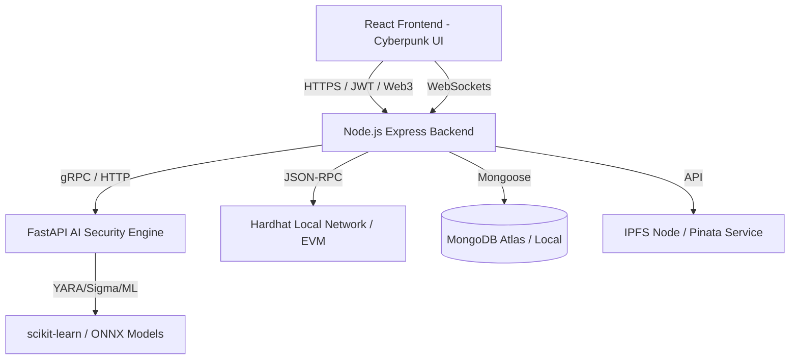

# Implementation Plan: AI-Powered Secure Decentralized File Sharing & Cyber Defense Platform

This document outlines the detailed architecture, directory structure, data models, smart contracts, security mechanisms, and user interface designs for the production-ready enterprise cybersecurity project: **"AI-Powered Secure Decentralized File Sharing and Cyber Defense Platform"**.

---

## Architecture Overview

The system is designed following a **Clean Architecture** pattern and a **Zero Trust** security posture. It consists of four primary components running in a unified Docker network:



### Components:
1. **Frontend (React + TypeScript + Tailwind CSS + Framer Motion)**: A premium glassmorphic, cyberpunk-styled dashboard that handles zero-knowledge client-side encryption, Web3 authentication, SIEM monitoring, threat forensics, compliance scorecards, and real-time alerts.
2. **Backend (Node.js + Express + TypeScript)**: The secure gateway and orchestrator. Validates Zero Trust checks, coordinates encryption workflows, issues JWT and session keys, persists audit records in MongoDB, triggers blockchain state transitions, and pushes real-time event updates via WebSockets.
3. **AI Engine (Python + FastAPI + Scikit-learn + YARA + ONNX)**: Evaluates file payloads and user telemetry. Performs static malware scans, OCR text PII scans, phishing email parsing, YARA/Sigma rule scanning, and runs UEBA (User Entity Behavior Analytics) models.
4. **Blockchain (Solidity + Hardhat)**: A secure smart contract deployment recording file CIDs, immutable cryptographic hashes, dynamic user access lists (RBAC/ABAC policy state), and digital signatures for compliance-grade evidence preservation.

---

## Directory Structure

We will initialize the project with the following clean, modular structure under the workspace root:

```text
/yadu
├── backend/
│   ├── src/
│   │   ├── config/             # DB, Web3, IPFS, Passport, environment configs
│   │   ├── middleware/         # ZeroTrust, Auth, RBAC/ABAC, Session, RateLimiter
│   │   ├── models/             # Mongoose schemas (Users, AuditLogs, Threats, Sessions)
│   │   ├── routes/             # API routes (auth, files, forensics, copilot, system)
│   │   ├── controllers/        # Express handlers matching routes
│   │   ├── services/           # Business logic (blockchain, encryption, IPFS, websocket)
│   │   ├── utils/              # Crypto helper, logger, validators
│   │   └── server.ts           # Express & WebSockets entrypoint
│   ├── package.json
│   └── tsconfig.json
├── frontend/
│   ├── src/
│   │   ├── assets/             # Images, custom fonts, icons
│   │   ├── components/         # Shared UI cards, charts, glassmorphic layout
│   │   ├── context/            # AuthContext, ThemeContext, Web3Context
│   │   ├── hooks/              # useAuth, useWebSocket, useForensics
│   │   ├── pages/              # Dashboard, Vault, Forensic, SIEM, Copilot, Admin
│   │   ├── services/           # Axios APIs (auth, files, AI engine)
│   │   ├── utils/              # Client-side AES-256 / RSA crypto helpers
│   │   └── App.tsx
│   ├── index.html
│   ├── tailwind.config.js
│   ├── package.json
│   └── tsconfig.json
├── ai_engine/
│   ├── app/
│   │   ├── models/             # Pre-trained/stub scikit-learn models (malware, UEBA)
│   │   ├── rules/              # YARA / Sigma detection rule definitions
│   │   ├── services/           # Malware scan, UEBA, Copilot NLP engine, PII parser
│   │   ├── routers/            # FastAPI routers (scan, ueba, copilot, feeds)
│   │   └── main.py             # FastAPI entrypoint
│   ├── requirements.txt
│   └── Dockerfile
├── blockchain/
│   ├── contracts/
│   │   ├── FileRegistry.sol    # Secure file metadata, permissions & audit log contract
│   │   └── DecentralizedID.sol # DID and Verifiable Credential registry
│   ├── scripts/
│   │   └── deploy.ts
│   ├── test/
│   │   └── FileRegistry.test.ts
│   ├── hardhat.config.ts
│   └── package.json
├── docker-compose.yml
└── README.md
```

---

## User Review Required

> [!IMPORTANT]
> **Metamask & Blockchain network:** Since we want to ensure the application works out-of-the-box for demoing and evaluation, we will configure Hardhat to run a local node. We will provide automated wallet connecting scripts and credentials in the logs.
> 
> **IPFS Storage:** By default, files are pinned to a local mock folder mimicking IPFS CID behavior, but Pinata configuration options will be fully integrated. If real Pinata credentials (`PINATA_API_KEY`, `PINATA_API_SECRET`) are provided in `.env`, the system will automatically upload to Pinata.
> 
> **AI Library Dependencies:** The Python AI engine will use lightweight vectorizers, scikit-learn, and yara-python (or custom fallback regex matching to prevent native C compilation errors on Windows) to guarantee maximum stability.

---

## Open Questions

1. **Behavioral Biometrics & Continuous Auth:** For continuous authentication, do you prefer mouse tracking (speed/trajectory metrics) or typing cadence analysis (keystroke dynamics) during regular session interactions? (We plan to implement a dynamic hybrid tracking engine inside React hooks).
2. **Post-Quantum Cryptography (PQC):** Shall we integrate a mock module implementing Dilithium / Kyber keys to simulate post-quantum key agreement alongside standard RSA-4096 and ECC?

---

## Proposed Changes

We will build the components sequentially:

### 1. Blockchain (Hardhat & Solidity Contracts)
- **FileRegistry.sol**: Contains mapping of `fileId => FileMetadata`. 
  - Functions: `registerFile(...)`, `grantAccess(...)`, `revokeAccess(...)`, `transferOwnership(...)`, `emergencyLock(...)`, `verifySignature(...)`.
  - Emits event audits for all state-changing operations.
- **DecentralizedID.sol**: Stores public keys and DIDs mapped to owner addresses.

### 2. AI Security Engine (FastAPI)
- **Endpoints**:
  - `POST /api/v1/scan/file`: Performs entropy scan, regex PII check (SSN, credit card, Aadhaar, PAN), runs YARA rules, scans for signature indicators.
  - `POST /api/v1/scan/ueba`: Checks user behavioral parameters (geography, concurrent logins, typing/mouse anomaly) and returns a Risk Score (0-100).
  - `POST /api/v1/copilot/chat`: Returns response dynamically explaining alerts, compliance posture, and resolving incidents.
  - `GET /api/v1/feeds/threats`: Aggregates active CVE details and threat feeds.

### 3. Backend Gateway (Node.js + TS)
- Configures Passport (JWT + OAuth/Wallet) and WebSocket server (`ws`).
- Implements hybrid encryption logic: Generates custom AES key per file, wraps with owner's RSA public key.
- Integrates MongoDB schemas for user profiles, transaction logs, threat logs, and sessions.
- Middleware: `zeroTrustGuard.ts` checking IP, geo, user behavior score, and device status.

### 4. Frontend Application (React + TS + Tailwind + Framer Motion)
- **Theme**: Premium Cyberpunk dark theme using deep violets/blues, electric cyans, neon pink alerts, and CSS glassmorphism.
- **Dashboard Views**:
  - **SIEM & Security Posture**: Live attack timeline, interactive charts for file status, map of simulated ingress threats.
  - **Vault**: Drag-and-drop secure uploading, real-time scanning animated indicators, metadata controls.
  - **Forensics / Chain of Custody**: Node tree displaying origin, transaction signatures, and hashes from blockchain ledger.
  - **Compliance Suite**: Checklist tracker mapping activity to ISO 27001, GDPR, and NIST CSF.
  - **AI Copilot Panel**: Floating sidebar chat widget to help security analysts.
  - **Admin console**: Live management of system metrics, IP whitelists, policy overrides, and key rotations.

---

## Verification Plan

### Automated Tests
- **Smart Contracts**: Run `npx hardhat test` to verify access control, permissions sharing, and audit logging.
- **Backend APIs**: Core routes (auth, metadata validation) tested using Jest.
- **AI Engine**: Python-based pytest files verifying rule scans and score bounds.

### Manual Verification
- Launch docker-compose environment or separate terminals.
- Connect MetaMask wallet to local Hardhat node.
- Upload a file containing dummy PII (e.g. `4000-1234-5678-9010`) to confirm AI detection triggers blocking/flagging.
- Try downloading from an unwhitelisted/high-risk simulated IP to trigger Zero Trust block.
